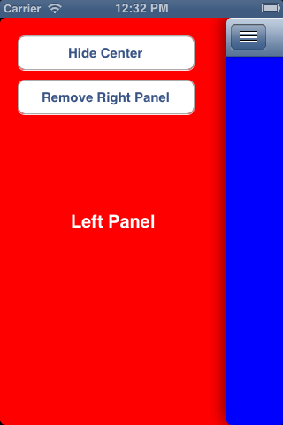
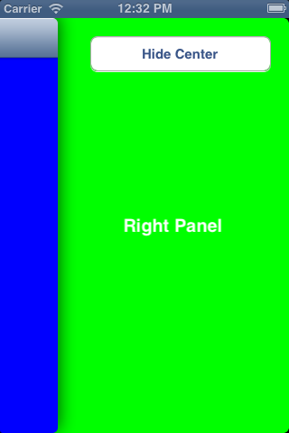

# JASidePanels Demo Using RubyMotion

This is a RubyMotion demo using the [JASidePanels](https://github.com/gotosleep/JASidePanels) library. Covers everything you need to know to implement path-like / facebook-like sidebars.

Same as [their demo](https://github.com/gotosleep/JASidePanels/tree/master/JASidePanels/Demo), with a few tweaks.

## What it looks like

